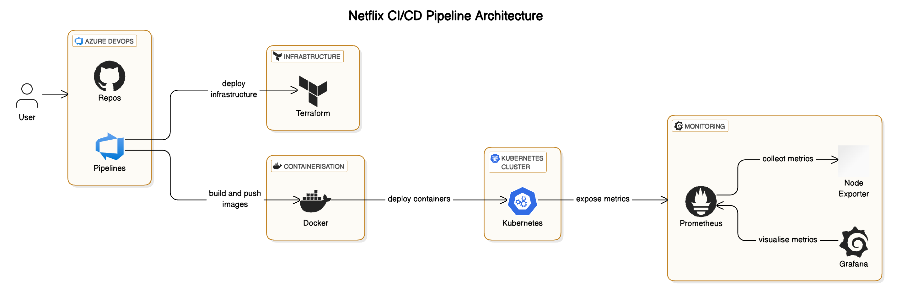

THIS IS AN ONGOING PROJECT AND WILL BE UPDATED FREQUENTLY

# Azure Netflix Clone Infrastructure

This project contains the Infrastructure as Code (IaC) for deploying a Netflix clone application on Azure using Terraform and Azure DevOps for CI/CD.



## Prerequisites

- Azure Subscription
- Azure DevOps Organization
- GitHub Account
- Terraform (latest version)
- Azure CLI
- SonarQube Cloud Account

## Project Structure

```
├── main.tf              # Main Terraform configuration
├── variables.tf         # Variable definitions
├── terraform.tfvars     # Variable values (do not commit sensitive data)
├── backend.tf           # Backend configuration for state management
└── azure-pipelines.yml  # Azure DevOps pipeline definition
```

## Setting Up the Pipeline

1. **Fork/Clone the Repository**
   ```bash
   git clone https://github.com/your-username/Azure_Netflix_Project.git
   cd Azure_Netflix_Project
   ```

2. **Create Azure DevOps Project**
   - Go to dev.azure.com
   - Create a new project
   - Name it appropriately (e.g., "Azure-Netflix")

3. **Configure Service Connections**
   - Go to Project Settings > Service Connections
   - Create "devOps-connection" for Azure Resource Manager
   - Create "GitHub" connection for your repository
   - Create "SonarCloud" connection if using code analysis

4. **Set Up Variable Group**
   - Go to Pipelines > Library
   - Create a variable group named "netflix-variables"
   - Add the following variables:
     - `admin_username` (your VM admin username)
     - `admin_password` (mark as secret)
     - `my_ip_address` (your IP for NSG rules)

5. **Configure Pipeline**
   - Go to Pipelines > New Pipeline
   - Select GitHub as source
   - Select your repository
   - Choose "Existing Azure Pipelines YAML file"
   - Select azure-pipelines.yml

## Pipeline Stages

1. **Analysis**
   - Runs SonarCloud analysis for code quality
   - Publishes quality gate results

2. **Validate and Plan**
   - Initializes Terraform
   - Creates execution plan
   - Validates infrastructure changes

3. **Deploy (Optional)**
   - Applies the Terraform plan
   - Deploys infrastructure to Azure
   - Currently commented out for safety

## Infrastructure Components

- Virtual Network with multiple subnets
- Network Security Groups
- NAT Gateway
- Linux VM with:
  - SSH access (secured by IP restriction)
  - Prometheus monitoring
  - Grafana dashboards
- Azure Key Vault for secrets

## Security Features

- SSH key authentication (password auth disabled)
- IP-restricted access
- Secrets stored in Key Vault
- Network security groups with minimal required ports

## Making Changes

1. Update your IP address in variables if needed
2. Make infrastructure changes in Terraform files
3. Commit and push to GitHub
4. Pipeline will automatically:
   - Validate changes
   - Run security checks
   - Plan the deployment

## Notes

- The Deploy stage is commented out by default
- Uncomment it when ready for automated deployments
- Always review the plan before applying changes
- Keep terraform.tfvars out of source control

## Monitoring

- Prometheus available on port 9090
- Grafana dashboards on port 3000
- Node Exporter metrics on port 9100

### Key Technologies and Tools

- Azure DevOps
- Terraform
- Powershell
- Docker
- Kubernetes
- Grafana
- Prometheus
- SonarQube Cloud
- Prometheus
- Node Exporter

